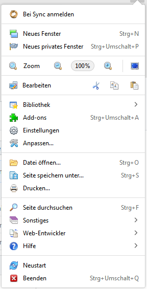
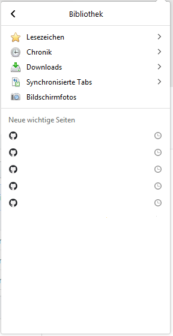
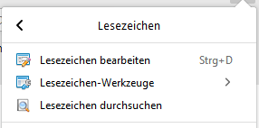
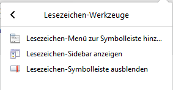
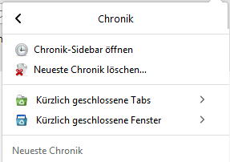
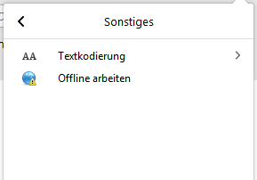
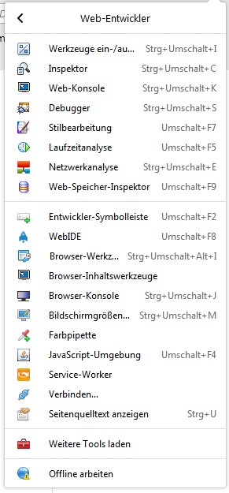
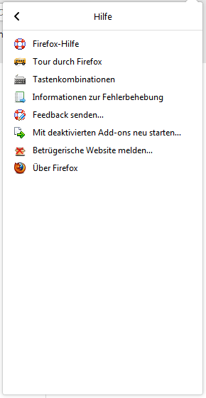

## Anpassungen für das Hamburgermenü und Subordner. ##   

### Symbole für die Einzelnen Einträge ###

CSS Code ***Hamburger.css*** muss über die ***userChrome.css*** Datei   
geladen oder Importiert werden.    

So sollte es dann aussehen:    
           

Damit hier auch bei Bildschirmfotos obiges Symbol angezeigt wird, ***muss***    
das userChrome Script ***Hamburger-Symbol.uc.js*** installiert werden.

***Weitere Screenshots***

           

         

         

Für ***Chronik, Hilfe, Sonstigs*** und ***Web-Entwickler muss*** jeweils    
auch der entsprechende CSS Code über die ***userChrome.css*** Datei   
geladen oder Importiert werden.    

### CSS Codes ###

* [Hamburger.css](https://github.com/Endor8/CSS/blob/master/Firefox/Hamburger-Panel/Hamburger.css)
* [Submenu-Chronik.css](https://github.com/Endor8/CSS/blob/master/Firefox/Hamburger-Panel/Submenu-Chronik.css)
* [Submenu-Hilfe.css](https://github.com/Endor8/CSS/blob/master/Firefox/Hamburger-Panel/Submenu-Hilfe.css)
* [Submenu-Sonstige.css](https://github.com/Endor8/CSS/blob/master/Firefox/Hamburger-Panel/Submenu-Sonstige.css)
* [Submenu-WebEntwickler.css](https://github.com/Endor8/CSS/blob/master/Firefox/Hamburger-Panel/Submenu-WebEntwickler.css)

### UC Script ###

* [Hamburger-Symbol.uc.js](https://github.com/Endor8/CSS/blob/master/Firefox/Hamburger-Panel/Hamburger-Symbol.uc.js)
