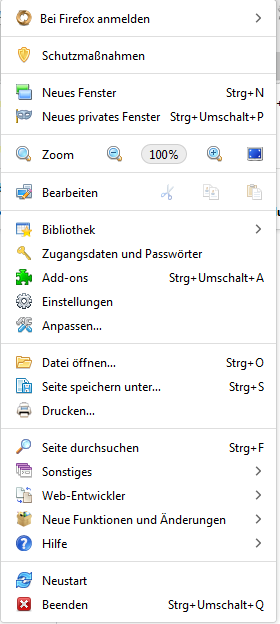

## Anpassungen für das Hamburgermenü und Subordner. ##   

### Symbole für die Einzelnen Einträge ###

CSS Code ***Hamburger.css*** muss über die ***userChrome.css*** Datei   
geladen oder Importiert werden.    

So sollte es dann aussehen:    
    

    

Damit hier auch bei Bildschirmfotos obiges Symbol angezeigt wird, ***muss***    
das userChrome Script ***Hamburger-Symbol.uc.js*** installiert werden.

***Weitere Screenshots***

    

    

   

